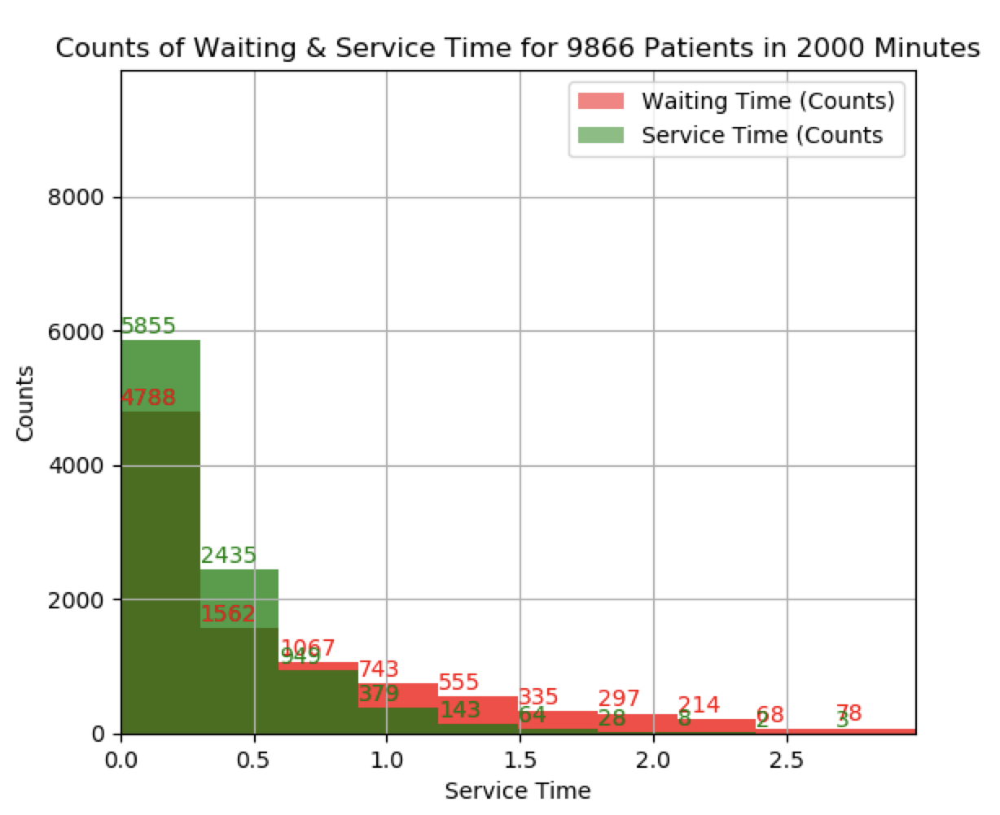

# M/M/k Queuing Model
Introduction
------------

This is a simplified queuing model simulator used for general m/m/k (k=3) queuing model


Documents
------------

Try and start with simple case, with [one station], [one queue], [three doctors in outpatint clinics] 

Arguments for default case:
* simulation time = 2000 units 🥥e.g., minutes
* exponential arrival rate = 5  🥥e.g., exp(λ=5), mean = 1/λ
* exponential service rate = 3 
* number of servers = 2 🥥2 doctors

```
python simulation.py --simT 2000 --arrT 5 --serR 3 --k 2

# sample output
0.58762 [average wait]
0.75758 [expect wait]
4.605 [average customer in system]
5.455 [expect customer in system]
```

